<div align="center">

# 🩺 Maternal Health Risk Screening

### Safety-first modelling, guideline calibration, and Urdu risk communication

**A maternal-risk screening prototype that asks a different question than the literature does — not "how accurate is the model?" but "does it change the referral decision, and can a Lady Health Worker actually say it out loud?"**

[](https://www.python.org/)
[](https://scikit-learn.org/)
[](https://xgboost.readthedocs.io/)
[](https://shap.readthedocs.io/)
[](https://streamlit.io/)
[](tests/)
[](LICENSE)

</div>

> [!CAUTION]
> **This is a research prototype, not a medical device.** It is not registered or certified, has not been validated on any patient population, and does not diagnose anything. It must not be used to make clinical decisions about any person.
>
> **Every number in this README was computed on a synthetic stand-in dataset**, not the real UCI file. They demonstrate that the pipeline and the analyses behave as specified — they are **not** findings about maternal health. See [Reproducing on real data](#-reproducing-on-real-data).

---

<div align="center">
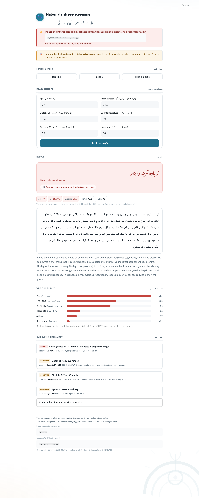
</div>

---

## 📌 Headline findings

<table>
<tr>
<td width="33%" valign="top">

### 🥇 The rules won
**No learned model beat 11 documented clinical thresholds on high-risk recall** — even after equalising referral load.

`0.918` vs `0.847`

</td>
<td width="33%" valign="top">

### 🛟 But models fail *softer*
The rule baseline sends **3.5%** of high-risk mothers home as low risk. The models send **1.2% or zero**.

Different error, not a smaller one.

</td>
<td width="33%" valign="top">

### 🔬 One column dominates
Reinterpreting the dataset's *undocumented* glucose column moves guideline agreement **64% → 31%**.

More than any model choice.

</td>
</tr>
</table>

---

## 🎯 Why this project exists

Classification on the [UCI Maternal Health Risk dataset](https://archive.ics.uci.edu/dataset/863/maternal+health+risk) is a solved exercise. The published work converges on one shape: preprocess, train a tree ensemble, report ~80–85% accuracy, conclude that ML is promising for maternal healthcare. Three things are wrong with that shape.

<table>
<tr><th width="30%">Gap</th><th>Why it matters</th><th width="22%">Addressed by</th></tr>
<tr>
<td><b>Accuracy hides the fatal error</b></td>
<td>37% of this cohort is low risk, so predicting "low risk" for everyone scores 37% accuracy and misses <b>every</b> high-risk mother. Accuracy also scores <i>mid risk for a high-risk mother</i> — which still escalates her — identically to <i>low risk</i>, which sends her home. Those differ in kind.</td>
<td><a href="src/mhrisk/metrics.py"><code>metrics.py</code></a><br>critical-miss rate, cost matrix, referral budget</td>
</tr>
<tr>
<td><b>Label transfer is assumed, never tested</b></td>
<td>The data was collected in <b>Bangladesh</b>, its labelling protocol was never published, and it is routinely used to argue for deployment elsewhere. That is an untested transfer assumption at the root of the model.</td>
<td><a href="src/mhrisk/guidelines.py"><code>guidelines.py</code></a><br>11 sourced criteria + calibration study</td>
</tr>
<tr>
<td><b>The output isn't deliverable</b></td>
<td>A probability in clinical English is not something a Lady Health Worker can say to a family in rural Punjab. The last mile is where a screening programme succeeds or fails.</td>
<td><a href="src/mhrisk/localization.py"><code>localization.py</code></a><br>hand-authored Urdu + CI lint rules</td>
</tr>
</table>

---

## ⚡ Quickstart

```bash
git clone https://github.com/laiba-mazhar/maternal-health-risk.git
cd maternal-health-risk
pip install -r requirements.txt
```

Runs immediately on the committed synthetic dataset — **no download, no network**:

```bash
python scripts/train.py --quick        # ~90 seconds
streamlit run app/streamlit_app.py     # the health-worker interface
```

| Command | What it does |
|---|---|
| `python scripts/download_data.py` | Fetch the real UCI dataset (free, no registration) |
| `python scripts/train.py --source real` | Full study: calibration → CV → selection → artifacts |
| `python scripts/predict.py --age 34 --sbp 148 --dbp 96 --bs 13.2 --temp 99.1 --hr 88` | Score one case from the CLI, with reasons |
| `python scripts/make_figures.py` | Regenerate all 7 figures |
| `python scripts/make_paper_tables.py` | Regenerate the paper's tables from artifacts |
| `python scripts/make_screenshots.py` | Regenerate the UI screenshots in this README |
| `python -m pytest` | 155 tests |

---

## 🖥️ The interface

Built for the actual setting: an entry-level Android handset, in a clinic, held by someone who has about twenty seconds.

### Three bands, three registers

The band, its Urdu name, how soon to act, and the exact measurements it was scored from — with anything crossing a guideline threshold highlighted.

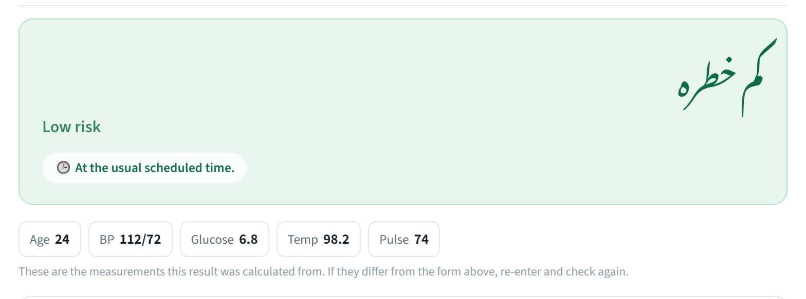

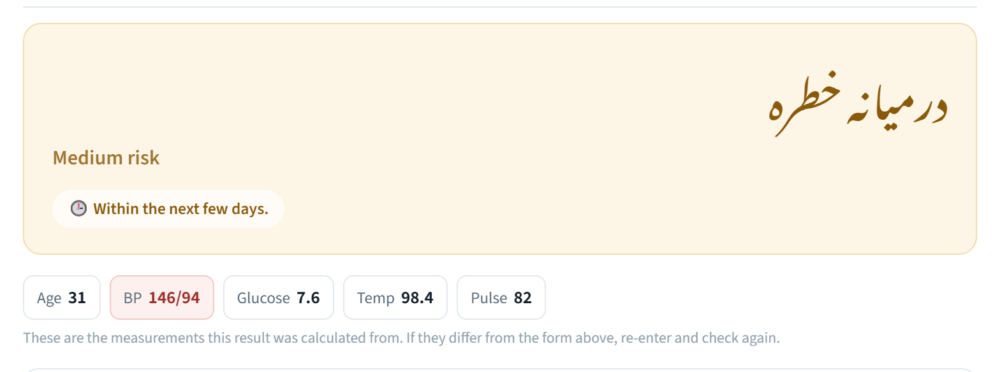

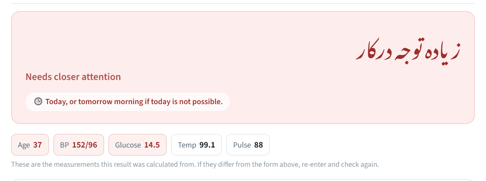

Note what the colours and the timeframes do: urgency is carried by **when to go**, never by frightening adjectives. The high band reads *"needs closer attention"*, not *"danger"*.

### Entering measurements

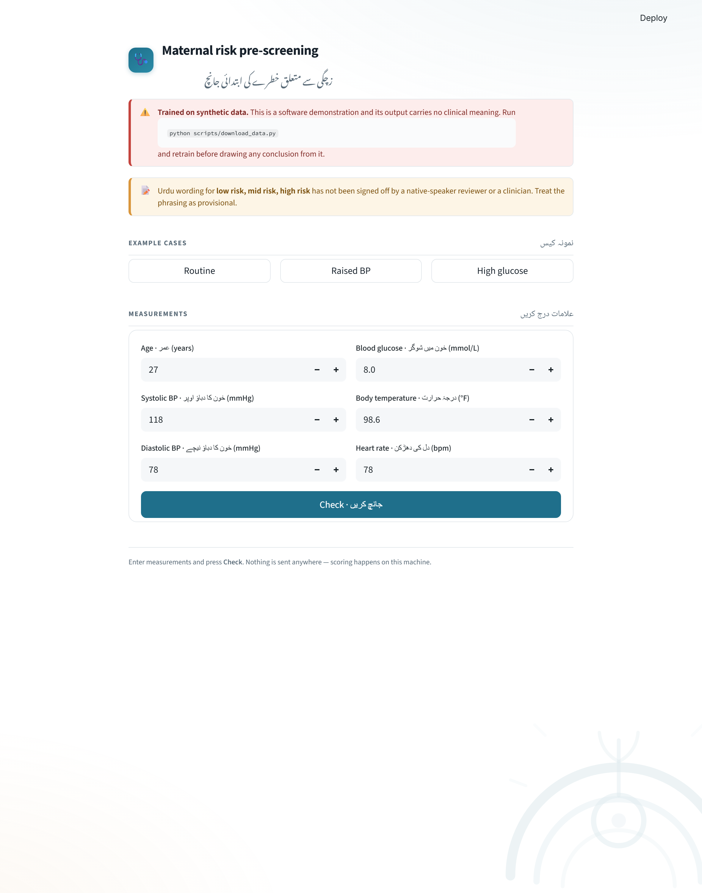

### On a phone

The intended user has an entry-level Android handset, so the 414px layout is the primary one rather than a courtesy.

<div align="center">
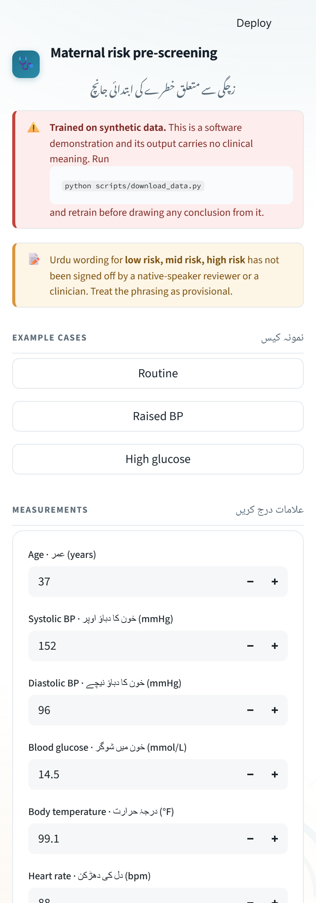
</div>

<details>
<summary><b>Full-page screenshots</b> — the complete screen for each band</summary>

<br>

**High risk** — full result, including driver bars and every cited criterion:


**Low risk** — deliberately quieter; note it lists no drivers at all:

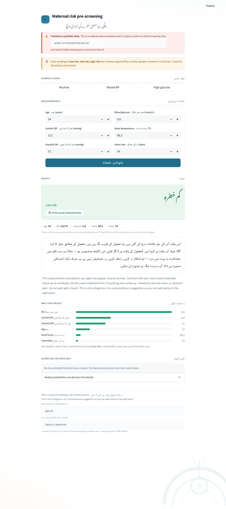

</details>

**Design decisions that came from the setting, not from Streamlit:**

- 🔤 **Urdu first, in a real Urdu face.** Noto Nastaliq Urdu for headings, Noto Naskh Arabic for body. A clinical message in a browser fallback font reads as untrustworthy before it is even understood.
- 🔢 **The number is never the headline.** A probability of 0.68 means nothing at the point of care. The band, the reason, and the recommended action lead; probabilities live in a collapsed expander.
- 🧾 **The result restates what it scored.** Measurement chips under the band, with any value crossing a guideline threshold highlighted — so the form and the result can never silently disagree.
- 🚦 **Nothing is shown without its reason.** Every band ships with its drivers and any guideline criteria that fired, so a health worker can disagree with it on informed grounds.
- 🔗 **Deep links.** `?case=high-glucose&show=1` reproduces any example case — which is also how the screenshots above are captured reproducibly.
- 🔒 **Offline by construction.** Scoring is local; the motif is inlined; no telemetry.

---

## 🧭 How it works

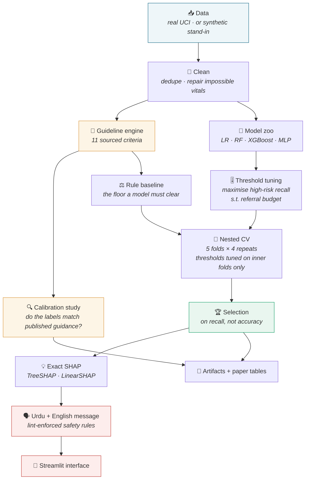

### The two mistakes this protocol is built to avoid

**1. Threshold leakage.** The referral thresholds are *fitted parameters*. Tuning them on the rows used to score the model is leakage. Every outer fold tunes its operating point on **inner** cross-validated probabilities from its own training portion, then applies that frozen point to the held-out fold.

**2. No floor.** Reporting 76% accuracy means nothing without knowing that always-predict-low scores 37% and eleven documented cut-offs score more. Both baselines run in the same loop, under the same metrics.

### The decision rule is separate from the model

Bands come from ordered thresholds, **not `argmax`**:

```
escalate to HIGH   when  P(high) ≥ t_high
escalate to MID    when  P(mid) + P(high) ≥ t_escalate
otherwise          LOW
```

A 40% chance of high risk therefore escalates even when low risk holds a 45% plurality — a decision `argmax` cannot express. Thresholds maximise high-risk recall **subject to a referral budget** (55%); without that constraint the optimum is always "refer everybody", which has perfect recall and gets switched off within a month.

---

## 📊 Results

> All figures below are from the **synthetic** stand-in. Regenerate on real data with `python scripts/train.py --source real`.

### Table 1 — Cross-validated performance (5 folds × 4 repeats, mean ± std)

Sorted by the project's primary metric. **Bold** marks the best in each column.

| Model | High-risk recall ⬆ | Critical miss ⬇ | Expected cost ⬇ | Referral rate ⬇ | Balanced acc. ⬆ | Accuracy ⬆ |
|---|---|---|---|---|---|---|
| 📏 `guideline_baseline` | **0.900** ± 0.041 | 0.036 ± 0.027 | **1.010** ± 0.221 | 0.633 ± 0.019 | 0.656 ± 0.031 | 0.640 ± 0.033 |
| 🏆 `logistic_regression` | 0.730 ± 0.059 | 0.044 ± 0.029 | 1.290 ± 0.201 | 0.542 ± 0.019 | **0.759** ± 0.020 | **0.764** ± 0.018 |
| `mlp` | 0.716 ± 0.054 | 0.036 ± 0.022 | 1.269 ± 0.161 | 0.548 ± 0.025 | 0.758 ± 0.020 | 0.764 ± 0.019 |
| `xgboost` | 0.663 ± 0.065 | 0.034 ± 0.024 | 1.395 ± 0.227 | **0.535** ± 0.023 | 0.740 ± 0.027 | 0.750 ± 0.025 |
| `random_forest` | 0.648 ± 0.047 | **0.029** ± 0.019 | 1.383 ± 0.186 | 0.542 ± 0.024 | 0.744 ± 0.022 | 0.755 ± 0.021 |
| ⚠️ `majority_baseline` | 0.000 | 1.000 | 8.417 ± 0.034 | 0.000 | 0.333 | 0.370 ± 0.001 |

> 🔎 **Read the last row first.** The degenerate model scores 37% accuracy — respectable-looking — while missing 100% of high-risk mothers and carrying **6× the expected cost** of the worst real model. A metric that cannot disqualify this model is not a safety metric.
>
> 🏆 `logistic_regression` is selected — on **recall**, not accuracy. It also happens to be the simplest and most inspectable model in the zoo.

### Figure 1 — What extra recall costs in referral load

<div align="center">
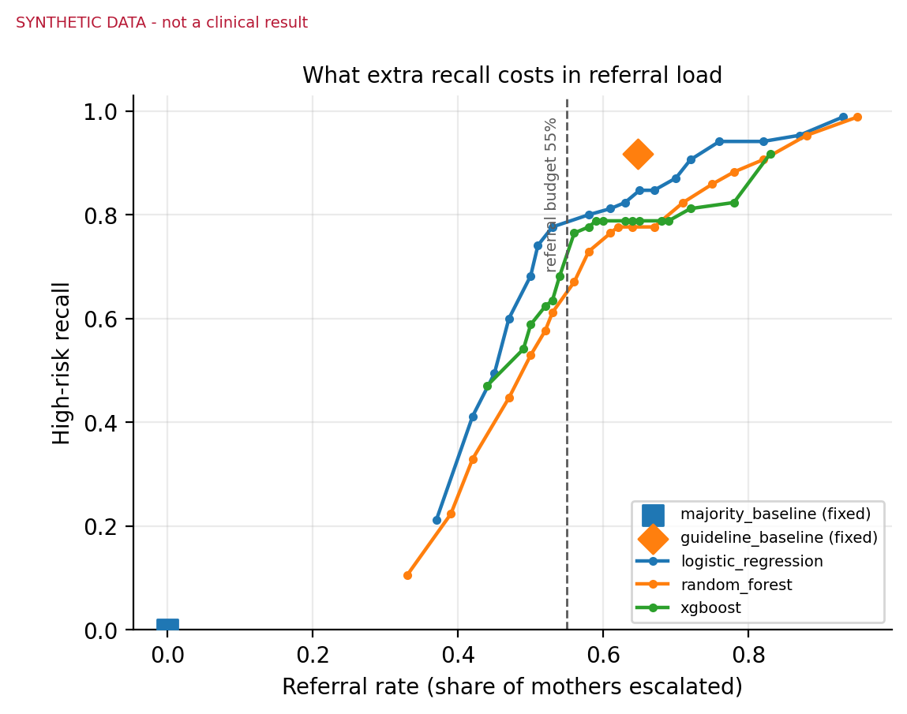
</div>

The orange diamond is the guideline rule. **It sits above every model curve at its own referral rate** — which is the whole negative result in one picture. The dashed line is the 55% referral budget.

### Table 2 — Everyone at the *same* referral load

A threshold-tuned model compared to a fixed rule at each system's own operating point is not a comparison — whichever refers more people wins on recall by construction. So every model is pushed to the guideline baseline's exact referral rate (~0.648) and compared there.

| Model | Referral rate | High-risk recall ⬆ | Critical miss ⬇ | Expected cost ⬇ | Balanced acc. ⬆ |
|---|---|---|---|---|---|
| 📏 `guideline_baseline` | 0.648 | **0.918** | 0.035 | 0.993 | 0.642 |
| `logistic_regression` | 0.648 | 0.847 | 0.012 | **0.907** | 0.700 |
| `mlp` | 0.638 | 0.835 | 0.012 | 0.887 | **0.731** |
| `xgboost` | 0.648 | 0.788 | **0.000** | 0.930 | 0.715 |
| `random_forest` | 0.651 | 0.776 | **0.000** | 0.987 | 0.699 |

**What this actually says.** The rules catch more high-risk mothers. The models almost never commit the *catastrophic* error — because a fixed rule has no graded confidence to fall back on: when no criterion fires it says "low risk" with no hedge available. So the defensible design is **neither**, it's **both**: run the documented criteria as a non-overridable safety net, and use the model to grade everything the rules leave silent.

> ⚠️ This is the claim most likely to reverse on real data. Re-derive it before repeating it.

### Table 3 — Do the dataset's labels agree with published guidance?

**64.0% exact agreement · linear κ = 0.584 · quadratic-weighted κ = 0.696**

|  | guideline: low | guideline: mid | guideline: high |
|---|---|---|---|
| **dataset: low** (370) | ✅ 267 | 88 | 15 |
| **dataset: mid** (350) | 90 | ✅ 121 | **139** |
| **dataset: high** (281) | ⚠️ 10 | 18 | ✅ 253 |

<div align="center">
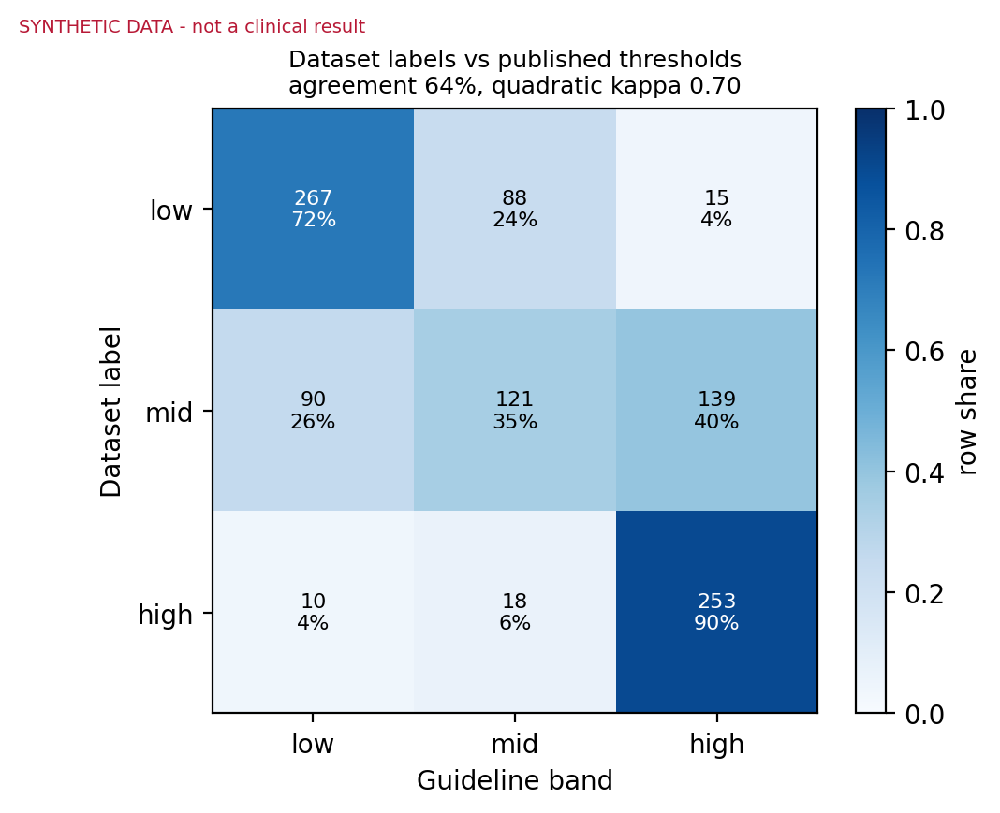
</div>

The disagreement has **structure**, not noise:

- **The guidelines are stricter in the middle** — 139 of 350 dataset "mid risk" mothers (40%) reach the guideline *high* band. Whatever protocol the labellers used was more permissive than published thresholds on exactly the ambiguous cases.
- **10% of dataset high-risk mothers fall below the guideline high band** — published thresholds alone would not escalate 28 of 281. A direct argument against replacing the model with a rule sheet.
- **15 dataset low-risk mothers reach the guideline high band** — the guidelines over-escalate relative to the labellers, at a low but non-zero rate.

### Table 4 — One undocumented column moves everything

The dataset gives blood glucose in mmol/L but never records **when the sample was taken**, and WHO thresholds differ sharply by sampling condition.

| Interpretation | GDM cut-off | Diabetes cut-off | Agreement | Quadratic κ | Flagged high risk |
|---|---|---|---|---|---|
| **2-hour OGTT** *(assumed)* | 8.5 | 11.1 | **0.640** | **0.696** | 40.7% |
| Fasting | 5.1 | 7.0 | 0.314 | 0.136 | **82.0%** |

Read as *fasting* values, **over 80% of a community-screening cohort would be diabetic** — not credible. Read as post-load values the distribution is clinically ordinary. This project assumes OGTT, says so in [`docs/UNITS.md`](docs/UNITS.md), and reports both readings on every run.

> 💡 **The methodological punchline:** the sampling condition of one undocumented column changes the clinical baseline more than any model, hyperparameter, or threshold in the entire study. Papers that train on this dataset without stating their glucose interpretation have left the most consequential assumption unstated.

### Table 5 — Which criteria actually do the work

Firing rate (%) of each guideline criterion, by dataset label.

| Criterion | Severity | Overall | low | mid | high |
|---|---|---|---|---|---|
| `diabetes_in_pregnancy` | 🔴 severe | 25.1 | 0.0 | 16.0 | **69.4** |
| `advanced_maternal_age` | 🟡 moderate | 25.1 | 4.1 | 26.3 | **51.2** |
| `gestational_hypertension_diastolic` | 🟡 moderate | 15.5 | 2.2 | 9.7 | **40.2** |
| `gestational_diabetes` | 🟡 moderate | 21.1 | 6.5 | **36.3** | 21.4 |
| `gestational_hypertension` | 🟡 moderate | 10.4 | 0.0 | 8.9 | 26.0 |
| `adolescent_pregnancy` | 🟡 moderate | 11.6 | 14.3 | 12.3 | 7.1 |
| `fever` | 🟡 moderate | 4.9 | 1.9 | 4.3 | 9.6 |
| `high_fever` | 🔴 severe | 3.0 | 1.9 | 1.7 | 6.0 |
| `severe_systolic_hypertension` | 🔴 severe | 1.0 | 0.0 | 0.0 | 3.6 |
| `severe_diastolic_hypertension` | 🔴 severe | **0.0** | 0.0 | 0.0 | 0.0 |
| `tachycardia` | 🟡 moderate | **0.0** | 0.0 | 0.0 | 0.0 |

<div align="center">
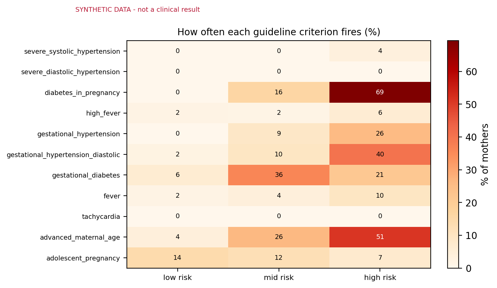
</div>

**Two criteria never fire.** Diastolic pressure never reaches 110 mmHg in this data and heart rate never exceeds 90 bpm, so severe diastolic hypertension and tachycardia are *unreachable*. They are kept in the rule set and reported as **silent** rather than quietly dropped — a criterion whose cut-off the data cannot reach is a fact about the data, and hiding it would hide a limitation.

### Table 6 — Feature attribution (exact LinearSHAP)

| Vital | mean \|SHAP\| | low risk | mid risk | high risk |
|---|---|---|---|---|
| **BS** (glucose) | **1.091** | 1.637 | 0.233 | 1.405 |
| **SystolicBP** | 0.525 | 0.788 | 0.152 | 0.636 |
| **DiastolicBP** | 0.446 | 0.626 | 0.044 | 0.669 |
| Age | 0.252 | 0.379 | 0.089 | 0.289 |
| HeartRate | 0.190 | 0.285 | 0.080 | 0.205 |
| BodyTemp | 0.120 | 0.138 | 0.042 | 0.181 |

<div align="center">
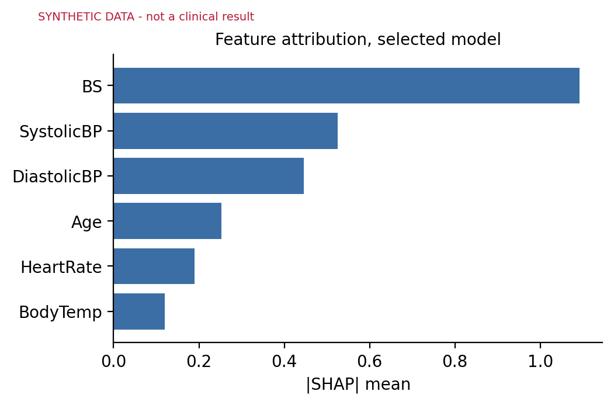
</div>

TreeSHAP on random forest and XGBoost produces **the same ordering**. Agreement across three model families and two exact SHAP implementations is a validity signal: glucose and blood pressure dominating a maternal-risk model is clinically expected, and a model leaning on body temperature would have been suspect regardless of its accuracy. It also matches the rule-activity table above — two methods, one from published thresholds and one from fitted coefficients, agreeing on which vitals carry the signal.

<details>
<summary><b>More figures</b> — class distribution, vitals by class, threshold stability</summary>

<br>

**Class distribution** — the class we least want to miss is the smallest:

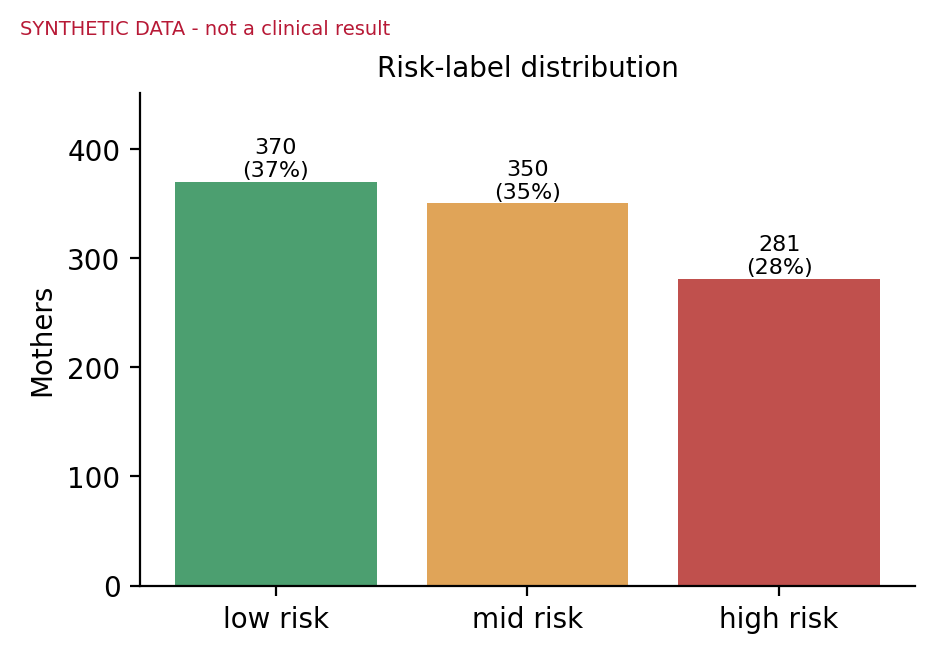

**Vitals by risk label** — glucose and blood pressure separate the classes; temperature barely does:

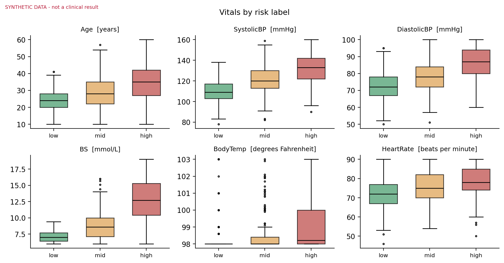

**Threshold stability across folds** — a threshold that swings fold to fold is not one to deploy. We report the spread rather than an averaged point estimate.

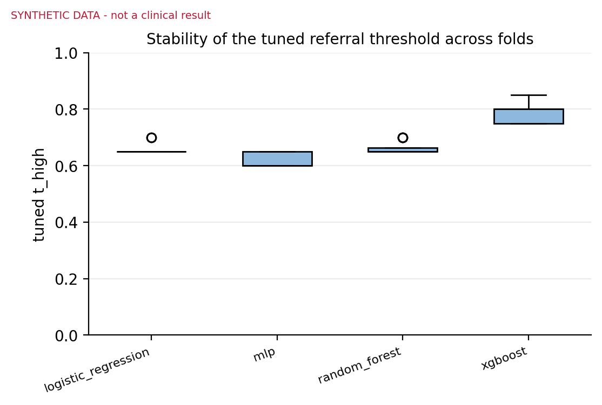

</details>

---

## 🗣️ Urdu risk communication

The Urdu here is **hand-authored, not machine-translated**. A mistranslated clinical instruction is a safety incident, and register matters as much as vocabulary.

Three commitments, enforced by **lint rules that run in CI** rather than by reviewer diligence — so a well-meaning later edit fails the build instead of shipping:

| # | Commitment | Why | Enforced by |
|---|---|---|---|
| 1 | **No catastrophising** | Urgency belongs in the action and its timeframe, never in frightening adjectives. A family that panics may go nowhere, or to the wrong place. | banned-term list (خطرناک, جان لیوا, "life-threatening", …) |
| 2 | **No diagnosis** | The tool reports observations and names who to see. It cannot confirm a condition, and a wrong disease name travels faster than a correct referral. | banned-condition list + mandatory disclaimer line |
| 3 | **Family-inclusive at the high band** | Where care decisions are made collectively, a message addressed only to the patient can stall against a household never consulted. | high band must carry family framing |

A fourth rule emerged from reading rendered output rather than from design:

> **4. The low band mentions no drivers at all.** Telling a mother her result is normal and then listing which of her vitals "stood out" plants worry the result does not justify — and worry is what makes a family ignore the next message.

### Worked example — high risk

```
Age 37 · BP 152/96 · Glucose 14.5 mmol/L · Temp 99.1°F · Pulse 88
```

<table>
<tr><th width="50%">اردو</th><th width="50%">English</th></tr>
<tr>
<td dir="rtl" align="right">

آپ کی کچھ علامات ایسی ہیں جن پر جلد توجہ دینا بہتر ہوگا۔ جو بات سامنے آئی: خون میں شوگر کی مقدار زیادہ ہے اور خون کا دباؤ معمول سے کچھ زیادہ ہے۔ براہِ کرم قریبی ہسپتال یا مرکزِ صحت پر کسی ڈاکٹر یا دائی سے معائنہ کروائیں۔ (آج ہی، یا آج ممکن نہ ہو تو کل صبح۔) اگر ممکن ہو تو گھر کے کسی بڑے یا شوہر کو ساتھ لے جائیں، تاکہ فیصلہ مل کر کیا جا سکے اور سفر میں آسانی ہو۔ یہ تشخیص نہیں ہے۔

</td>
<td>

Some of your measurements would be better looked at soon. What stood out: blood sugar is high and blood pressure is somewhat higher than usual. Please get checked by a doctor or midwife at your nearest hospital or health centre. (Today, or tomorrow morning if today is not possible.) If possible, take a senior family member or your husband along, so the decision can be made together and travel is easier. This is not a diagnosis.

</td>
</tr>
</table>

> [!WARNING]
> **Review status: `UNREVIEWED`.** The templates are hand-authored and lint-clean, but have **not** been signed off by a native-speaker reviewer or a clinician, and have never been tested with a health worker or patient. The app renders this status as a visible banner on every result, and it is written into `run_metadata.json`. "Plausible Urdu written by the author" is not "signed off", and the artifact says so.

---

## 🗂️ Repository layout

```
src/mhrisk/
├── config.py         paths · schema · label order · cost matrix · referral budget
├── data.py           real loader · synthetic generator · cleaning
├── guidelines.py     11 sourced clinical rules + the calibration study
├── metrics.py        safety metrics · decision rule · threshold tuning
├── models.py         model zoo · leakage-free CV protocol · selection rule
├── explain.py        TreeSHAP / LinearSHAP / permutation / occlusion
├── localization.py   Urdu + English templates · driver phrases · safety lint
└── pipeline.py       end-to-end run and artifact writing

app/streamlit_app.py  bilingual health-worker interface
scripts/              download_data · train · predict · make_figures
                      make_paper_tables · make_screenshots
tests/                155 tests, including the message-safety lint gate
docs/                 UNITS.md · ETHICS.md · KNOWN_ISSUES.md · img/
paper/                manuscript + generated tables + references
data/                 DATA_CARD.md · bundled synthetic CSV · raw/ (gitignored)
```

### 📚 Documentation worth reading

| Document | Contents |
|---|---|
| [`docs/UNITS.md`](docs/UNITS.md) | The undocumented glucose column, and two ranges that don't survive contact with obstetrics |
| [`docs/ETHICS.md`](docs/ETHICS.md) | What this is not · the failure that matters · message design · review status |
| [`docs/KNOWN_ISSUES.md`](docs/KNOWN_ISSUES.md) | Real bugs found and fixed, including two SHAP traps |
| [`data/DATA_CARD.md`](data/DATA_CARD.md) | Both datasets, and exactly how the synthetic one is built |
| [`paper/paper.md`](paper/paper.md) | The full manuscript |

---

## 🧪 Testing

```bash
python -m pytest                  # 155 tests
python -m pytest -m "not slow"    # skip the training-heavy ones
```

The suite is not decoration. Things it actually asserts:

- 🎯 **Selection prefers recall over accuracy** — given a more-accurate model and a safer one, the selector must pick the safer one.
- 🚫 **The degenerate model is exposed** — always-predict-low must score >0.55 accuracy *and* 0.0 high-risk recall, proving the metric set catches what accuracy rewards.
- 🔒 **Threshold tuning never breaches its own referral budget.**
- 📐 **Every clinical threshold is tested at its boundary** — 139 vs 140 mmHg, 100.3 vs 100.4 °F. An off-by-one on a cut-off is exactly the error that survives review and then mis-triages someone.
- 🗣️ **The message lint has teeth** — tests deliberately inject catastrophising wording and a diagnosis claim, and assert the linter catches both.
- 💥 **Explanations are never silently empty** — a regression test for a real bug where SHAP returned all zeros and the Urdu message quietly dropped its "what stood out" clause.
- 🧬 **Synthetic provenance propagates** into every artifact a reader might open on its own.

---

## 🔁 Reproducing on real data

Everything here runs on a synthetic stand-in by default so a fresh clone works offline. To produce real results:

```bash
python scripts/download_data.py           # free, no registration
python scripts/train.py --source real
python scripts/make_figures.py
python scripts/make_paper_tables.py
```

Single seed (`20260822`) through generation, splits, and every model. Each run writes `artifacts/run_metadata.json` with the data SHA-256, row counts, CV configuration, glucose interpretation, selected model, frozen operating point, attribution method, template review status, and library versions.

---

## ⚠️ Limitations

- **All reported numbers are synthetic.** They demonstrate the pipeline, not maternal health. The matched-referral conclusion is the most likely to change.
- **No Pakistani validation.** The calibration study *measures* the transfer gap; it does not close it.
- **Six features.** No gestational age, parity, obstetric history, proteinuria, or haemoglobin — several of which matter more than anything in this feature set. The ceiling is set by the data, not the models.
- **~1,000 rows**, hence noisy threshold estimates and wide confidence on every difference reported. Several gaps in Table 1 sit within one standard deviation.
- **The cost matrix is a judgement, not a measurement.** Pricing a critical miss at 25× an unnecessary referral is defensible but arbitrary; it is isolated in `config.py` so it can be challenged.
- **The Urdu is unreviewed** by a native speaker or a clinician.
- **The paper's citations need verifying** against DOIs before submission — see [`paper/README.md`](paper/README.md).

---

## 📄 Citation & licence

Released under the [MIT licence](LICENSE), with an additional not-a-medical-device notice.

```bibtex
@software{mazhar2026maternal,
  author = {Mazhar, Laiba},
  title  = {Maternal Health Risk Screening: Safety-First Modelling,
            Guideline Calibration, and Urdu Risk Communication},
  year   = {2026},
  url    = {https://github.com/laiba-mazhar/maternal-health-risk}
}
```

**Dataset:** Ahmed, M. *Maternal Health Risk Data Set*, UCI Machine Learning Repository (dataset 863). Collected in Bangladesh — which is the premise of the calibration study, not a footnote.

<div align="center">
<br>
<sub>Built by <a href="https://github.com/laiba-mazhar">Laiba Mazhar</a> · A research prototype, not a medical device · <a href="docs/ETHICS.md">Read the ethics statement</a></sub>
</div>
